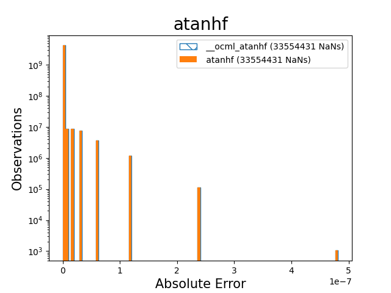
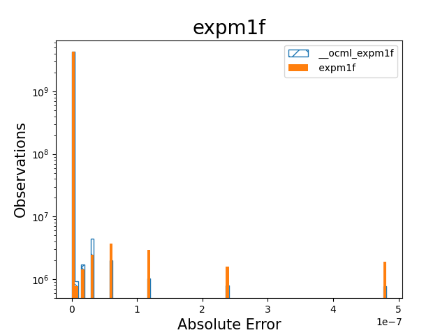
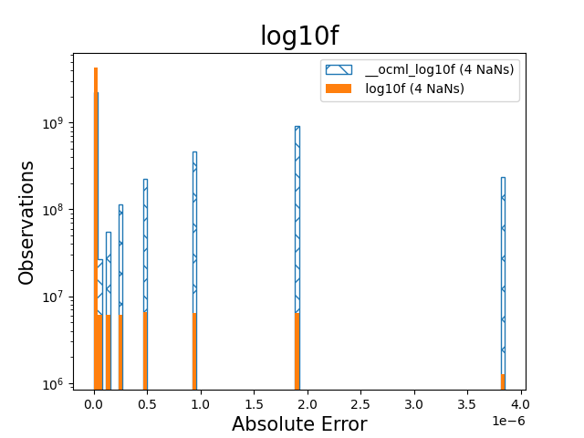

# Error Histograms for gfx90a
The following plots were obtained by running the different GPU implementations on all 2 to the 32 possible 32-bit floating point values. As it would take an infeasible amount of storage to plot the differences as function of the real axis, histograms displaying the distributions of the absolute errors have been made instead.
 
| | | |
|:-----:|:-----:|:-----:|
||
||
||
||
||
||
||
||
||
||
|