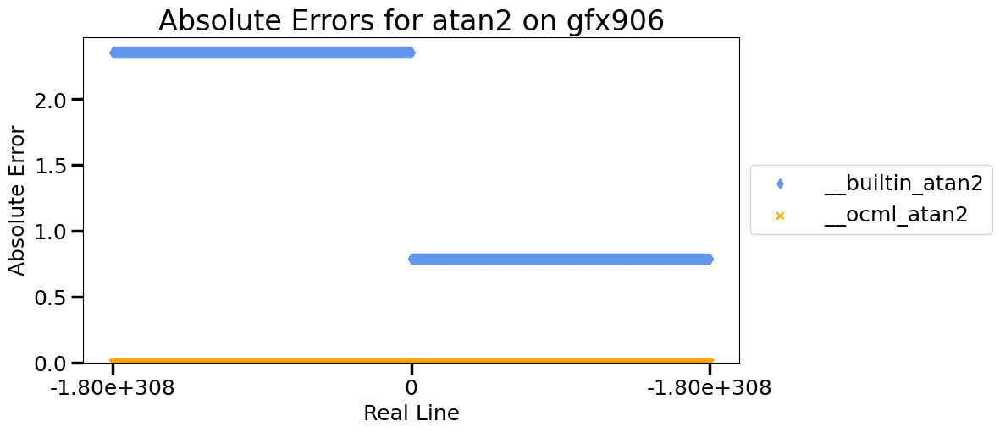

# Error Plots for gfx906
| Using LIBC Host Solution for Reference | Using Built-in Host Solution for Reference |
|:-----:|:-----:|
No LIBC reference | 
 | 
No LIBC reference | 
 | 
No LIBC reference | 
No LIBC reference | 
No LIBC reference | 
 | 
 | 
 | 
 | 
No LIBC reference | 
 | 
No LIBC reference | 
 | 
No LIBC reference | 
 | No builin-in reference
No LIBC reference | 
 | 
 | 
No LIBC reference | 
 | 
 | 
 | 
 | 
 | 
 | 
 | 
No LIBC reference | 
 | 
 | 
 | 
 | 
 | 
 | 
 | 
 | 
 | 
 | 
 | 
 | 
 | 
 | 
 | 
 | 
 | 
 | 
 | 
 | 
 | 
 | 
 | 
 | 
 | 
 | 
 | 
 | 
 | 
 | 
 | 
 | 
 | 
 | 
 | 
 | 
No LIBC reference | 
 | 
 | 
 | 
 | 
 | 
 | 
 | 
 | 
 | 
No LIBC reference | 
 | 
 | 
 | 
No LIBC reference | 
 | 
No LIBC reference | 
 | 
 | 
 | 
