# Timings for LIBC and OCML Math Functions on AMD MI50
The sinle-input math functions were tested on an AMD MI50 for 64 and 32-bit floating points. the functions were tested by running a naive kernel applying the functions to 4.3 GB of doubles / 2.15 GB of floats.
 64-bit            | 32-bit
:-------------------------:|:-------------------------:
 Missing | 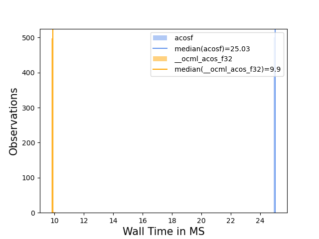 
 Missing | 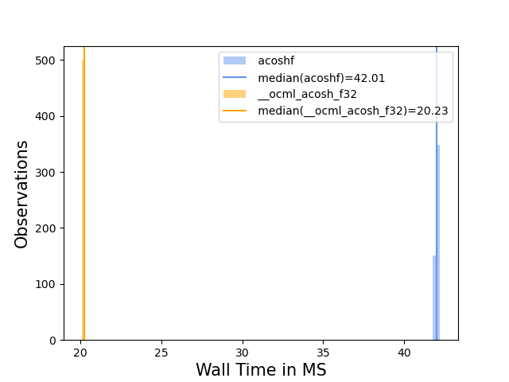 
 Missing | 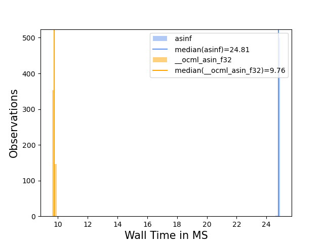 
 Missing |  
 Missing | 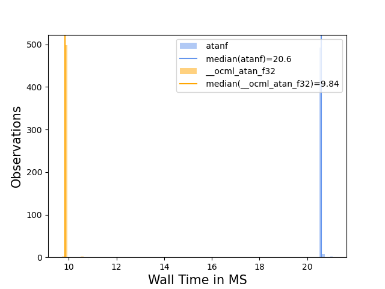 
 Missing | 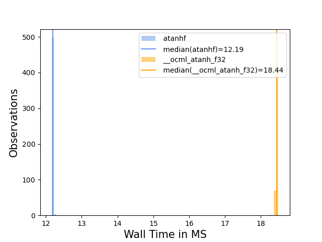 
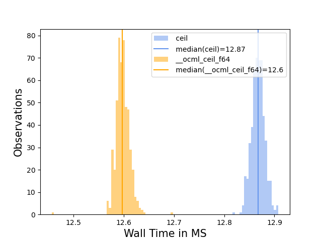  | 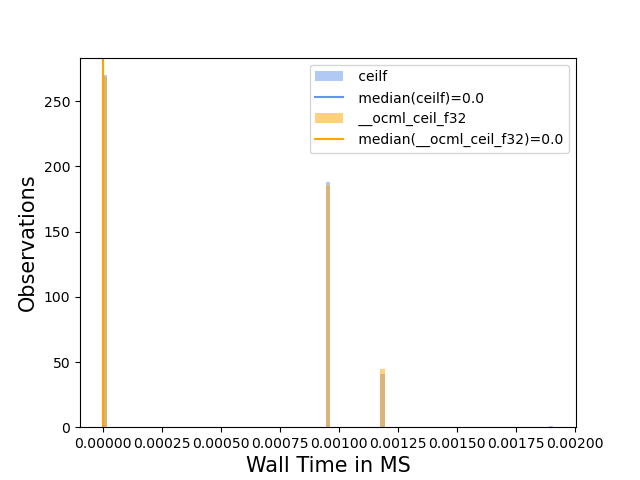
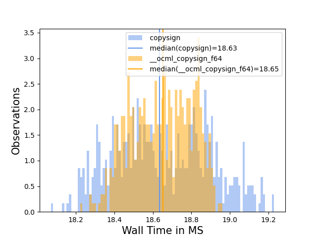  | 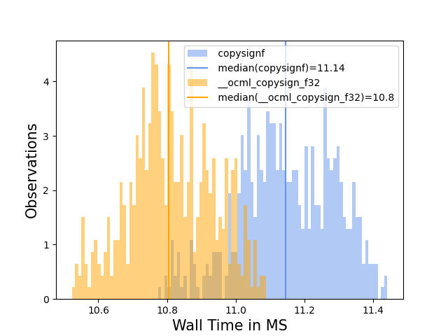
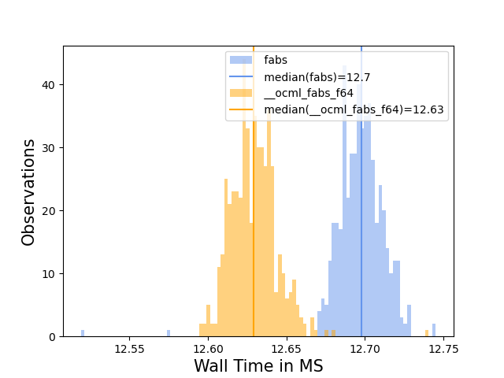  | 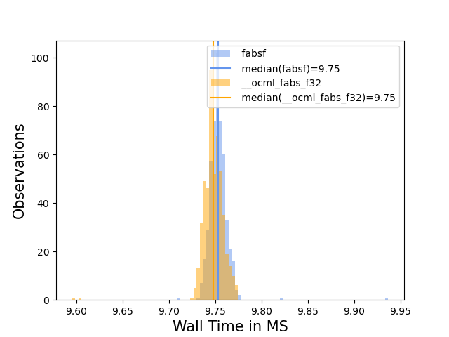
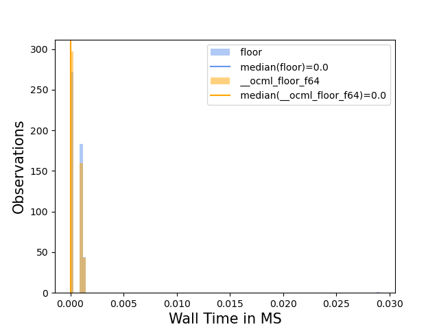  | 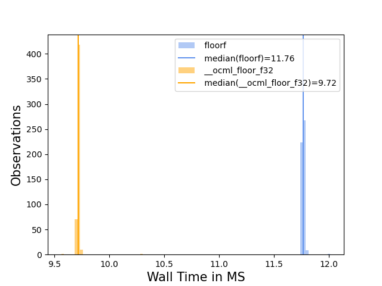
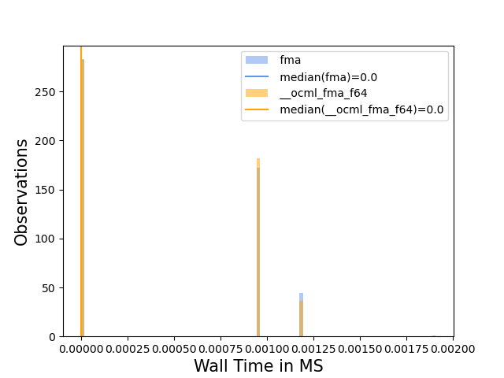  | 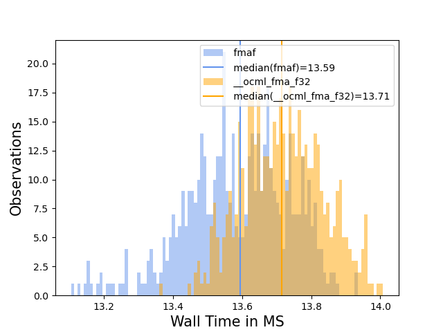
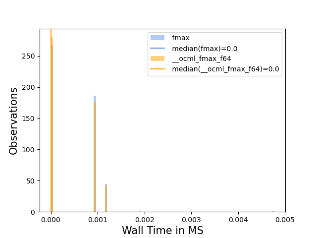  | 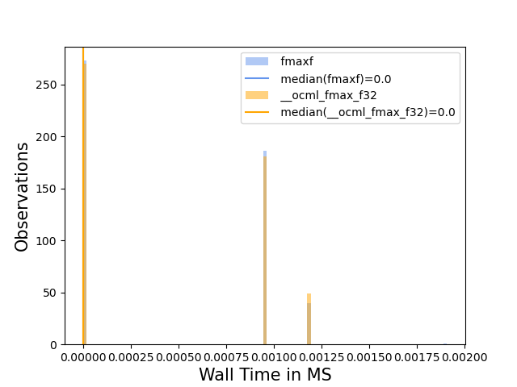
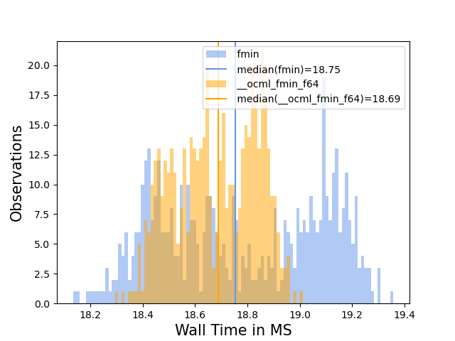  | 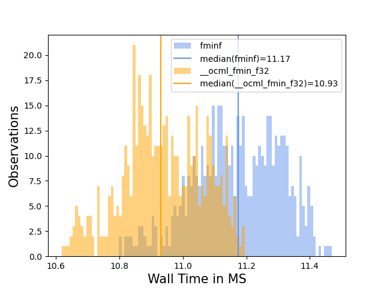
 Missing | 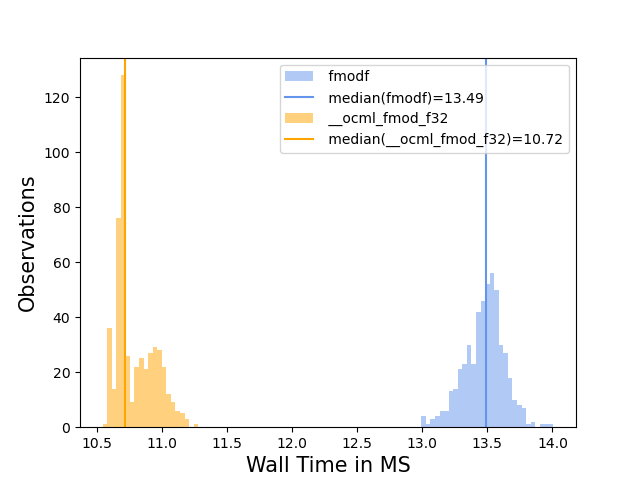 
  | 
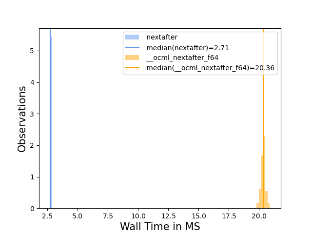  | 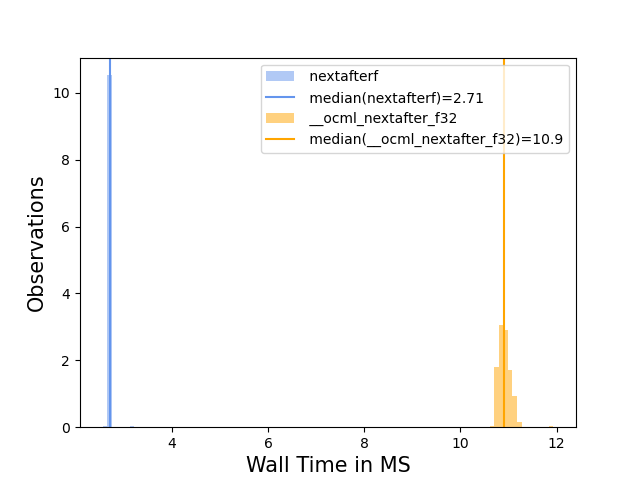
 Missing | 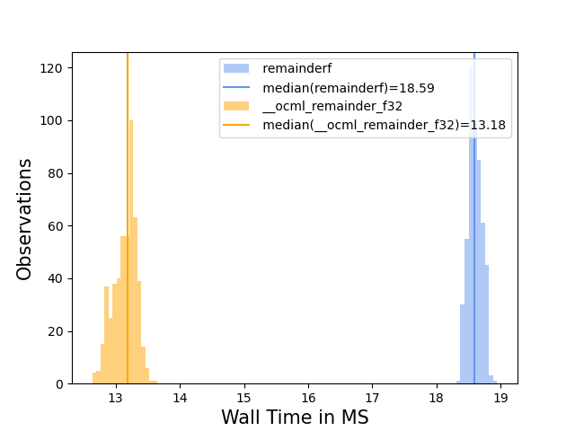 
  | 
  | 
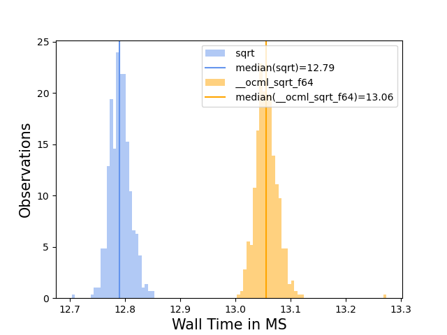  | 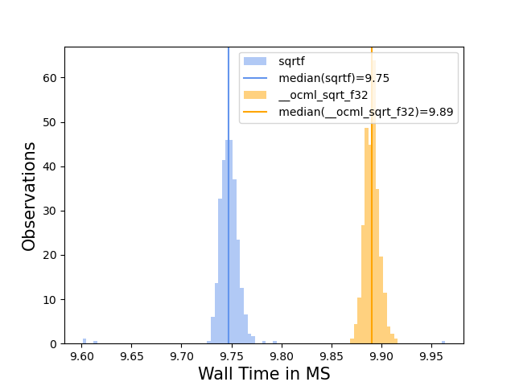
  | 
  | 
