# Timings for Generic LLVM LIBC, LLVM Built-in, and HIP Versions of the Math Functions from the C Standard Library
| | |
|:-----:|:-----:|
|
|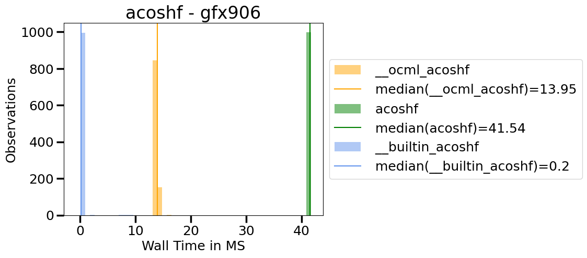
|
|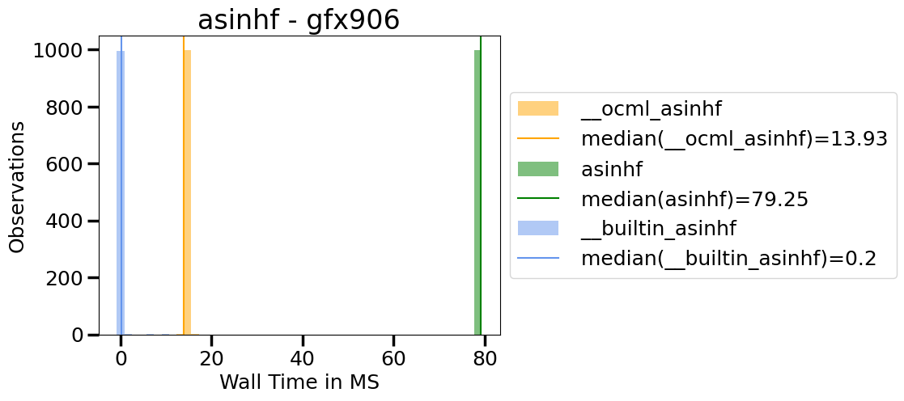
|
|
|
|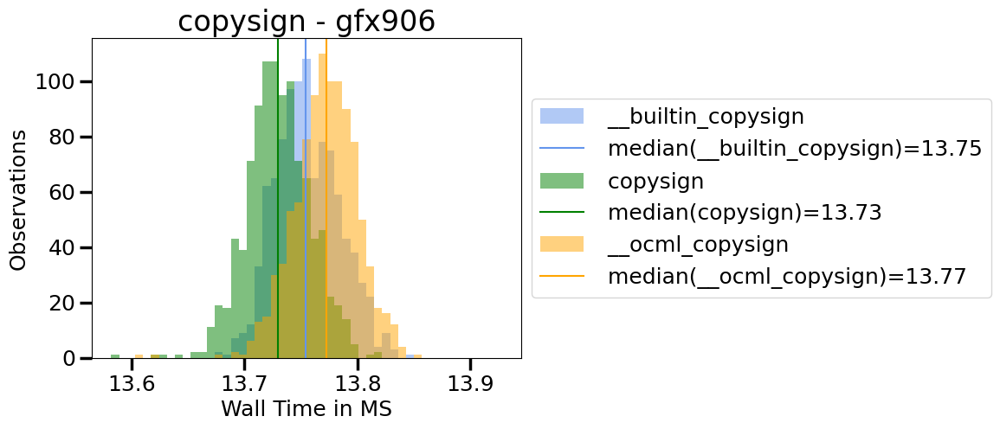
|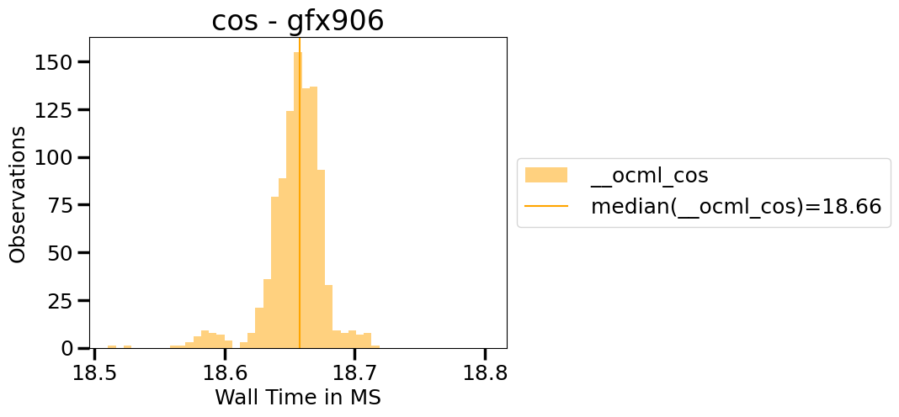
|
|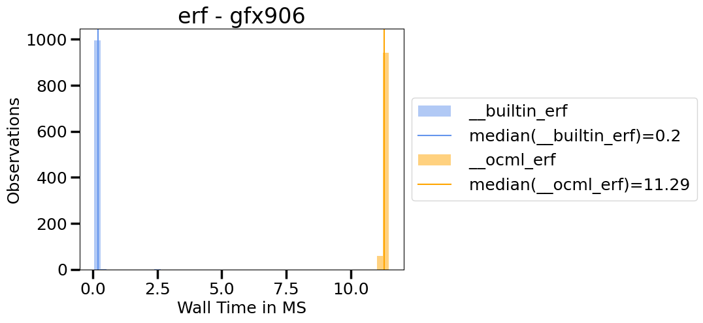
|
|
|
|
|
|
|
|
|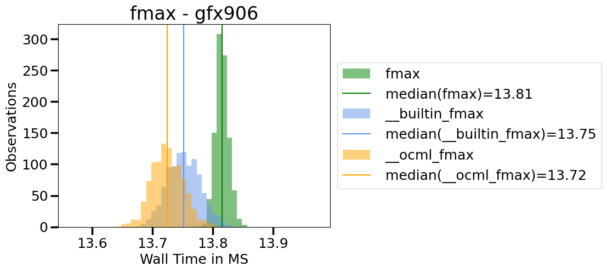
|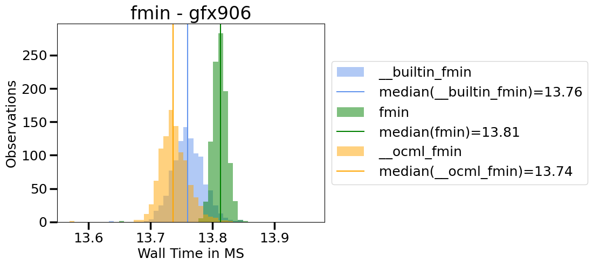
|
|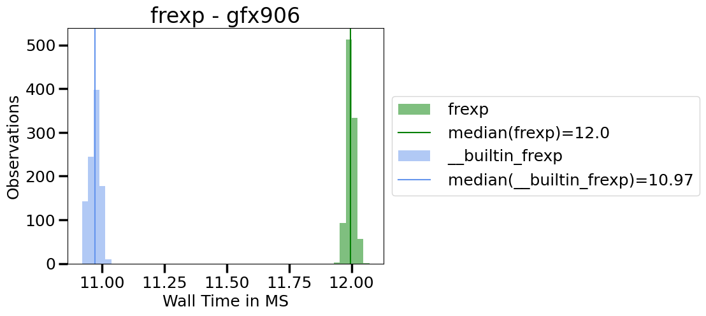
|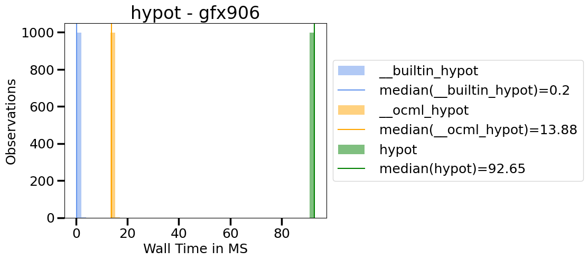
|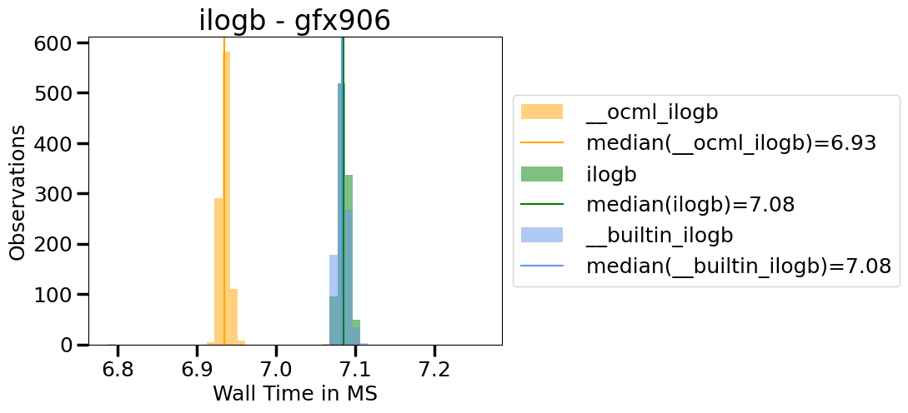
|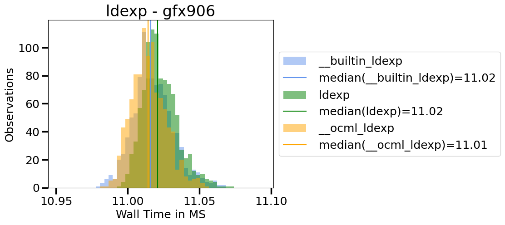
|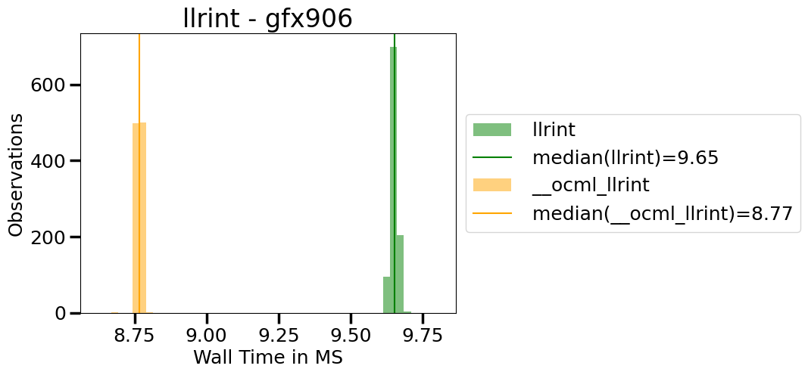
|
|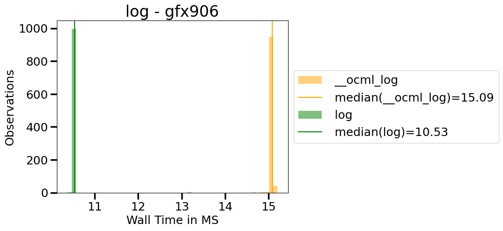
|
|
|
|
|
|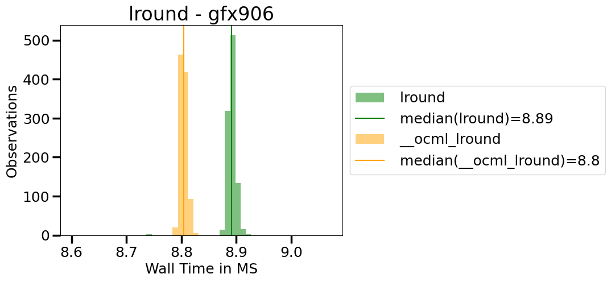
|
|
|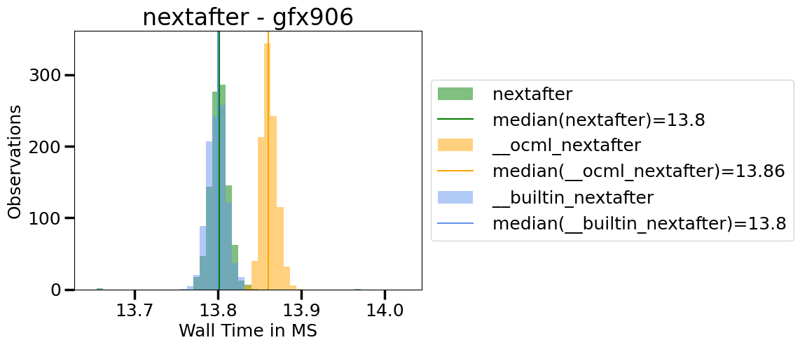
|
|
|
|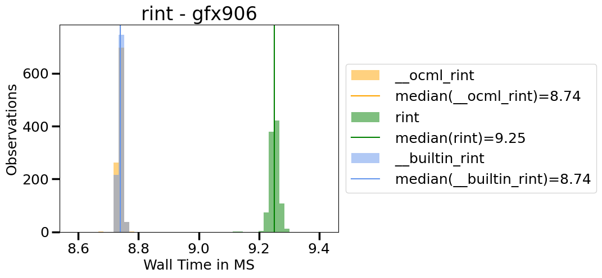
|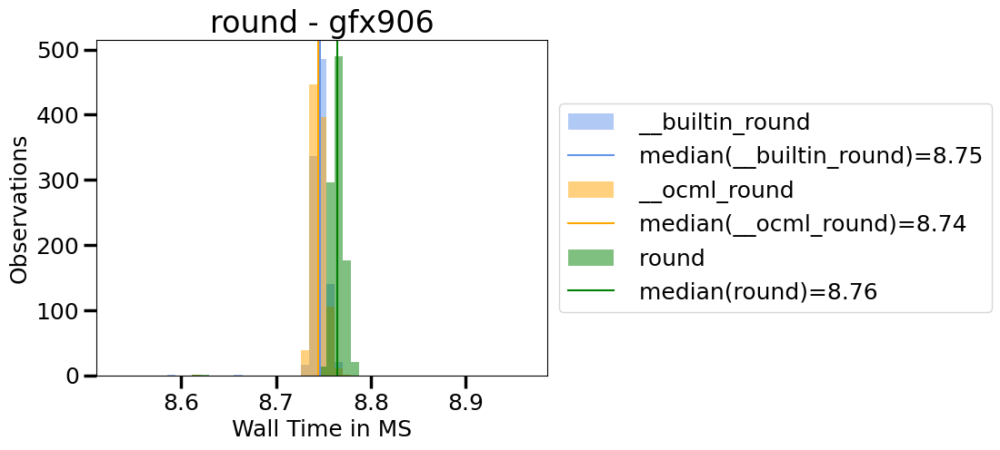
|
|
|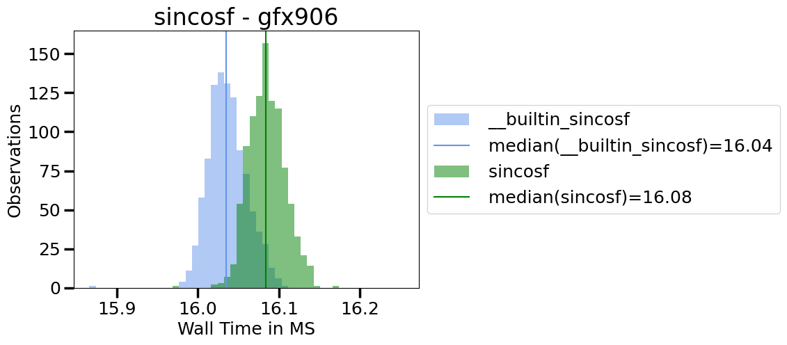
|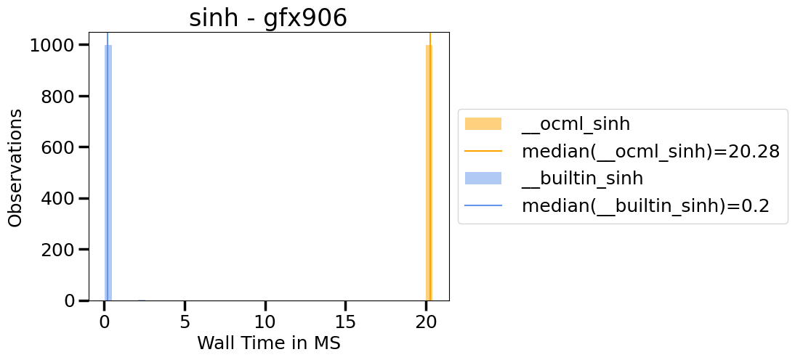
|
|
|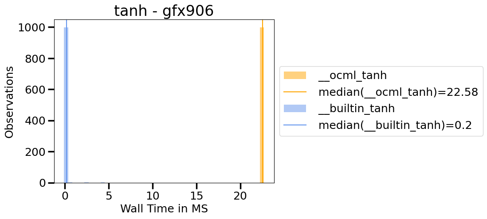
|
|
|